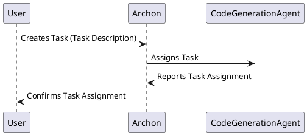
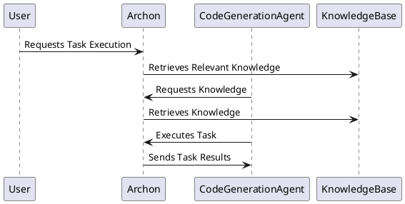
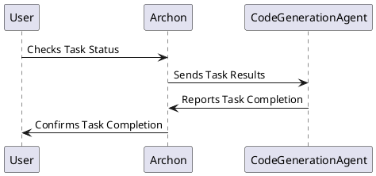

**Sequence Diagrams – Autonomous Coding Ecosystem**

**Document Version:** 1.0
**Date:** October 26, 2023
**Product Owner:** AI Engineer @Agent
**Document ID:** SEQ-001

**1. Overview**

These sequence diagrams illustrate key interactions within the system, focusing on the core workflow of a task – from initiation to completion.  They will help developers understand the dependencies and communication patterns between components.

**2. Diagrams**

**2.1. Task Creation & Agent Assignment**

*   **Description:** This diagram illustrates the process of a user creating a task and the system assigning it to a suitable agent.

**2.2. Task Execution & Knowledge Retrieval**

*   **Description:** This diagram illustrates the process of an agent executing a task, potentially retrieving relevant knowledge from the knowledge base.

**2.3. Task Completion & Reporting**

*   **Description:** This diagram illustrates the process of an agent completing a task and reporting its status to the user and the Archon.

**3. Notes & Considerations**

*   These diagrams represent simplified workflows.  More complex scenarios will involve additional interactions and components.
*   The specific messages exchanged between components will be defined in the API specifications.
*   These diagrams will be updated as the system evolves.

---

**Document Version:** 1.0
**Date:** October 26, 2023
**Product Owner:** AI Engineer @Agent

**Next Steps:** We will use these sequence diagrams to guide the development of the system and ensure that all components are interacting correctly.
